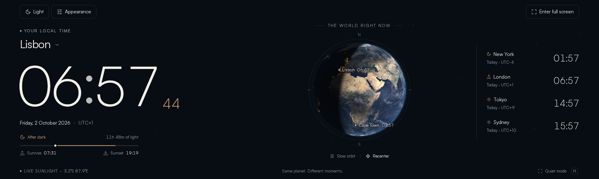
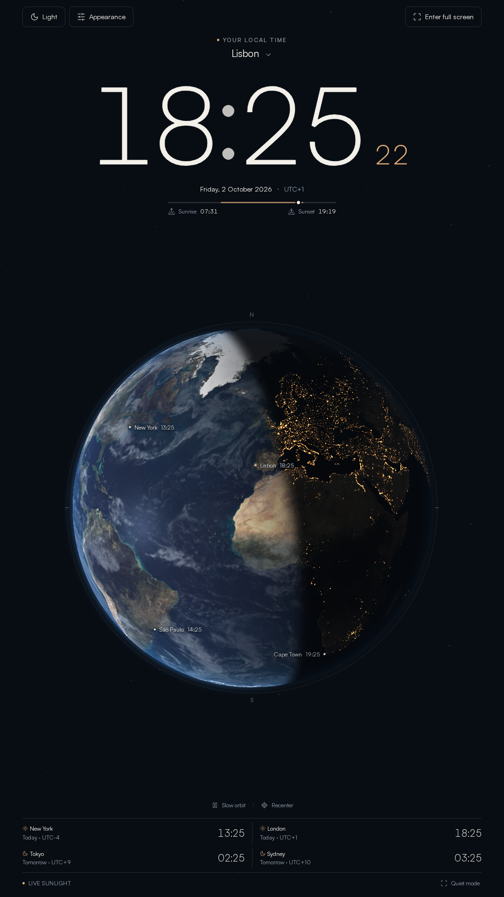
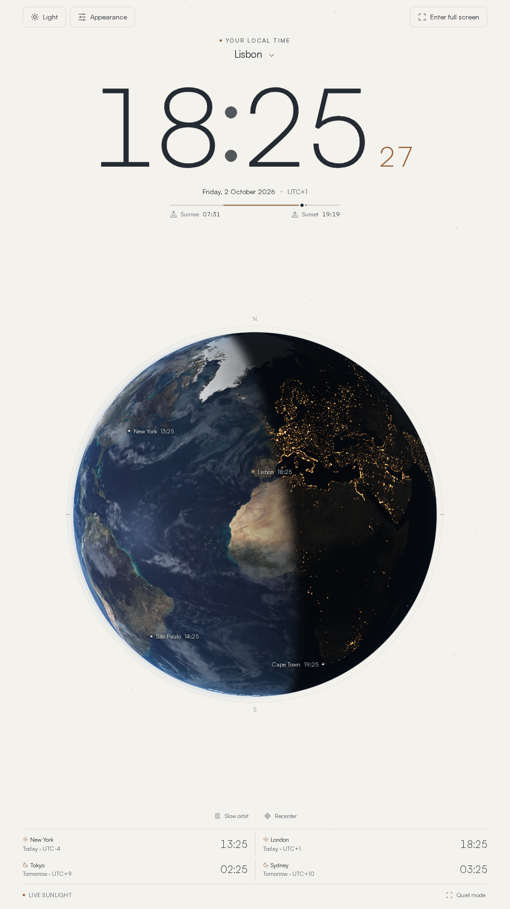
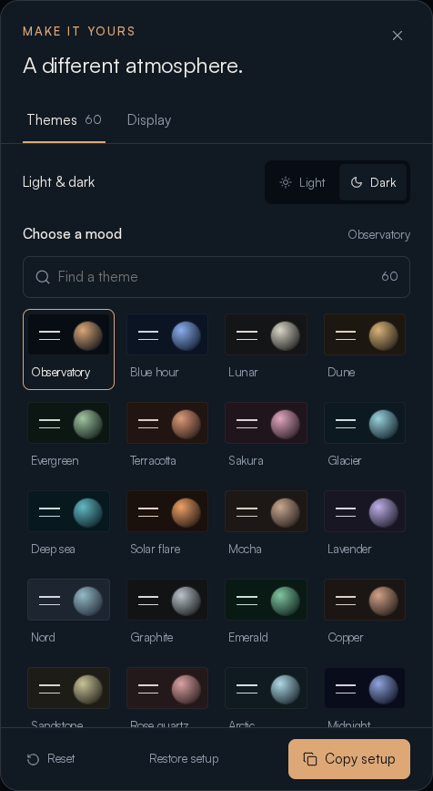
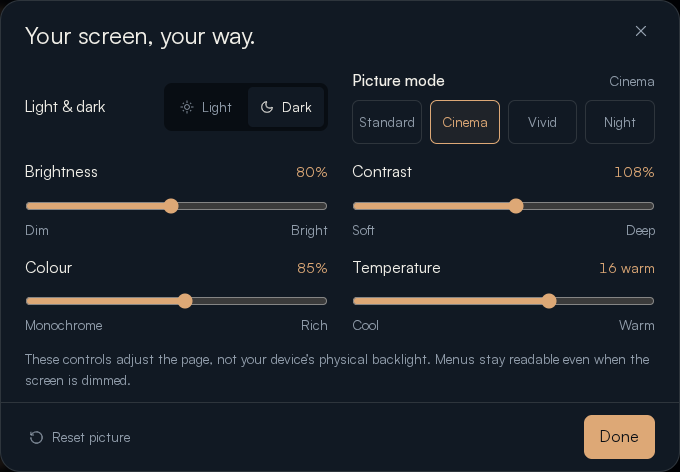
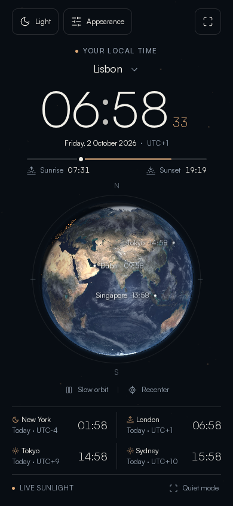

# Timescreen

<div align="center">



<br>

**A spare screen, put to good use.**<br>
An elegant fullscreen HTML5 clock for the vertical monitor I am not using.

**[Website](https://time.paulfleury.com)** · **[Download source](https://github.com/paulfxyz/timescreen/archive/refs/heads/main.zip)** · **[Install](INSTALL.md)** · **[Releases](https://github.com/paulfxyz/timescreen/releases)**

<br>

[](LICENSE)
[](https://time.paulfleury.com)
[](CHANGELOG.md)
[](public/index.html)
[](#a-vertical-screen-first)
[](#make-it-yours)
[](public/app.js)
[](public/earth.js)
[](#privacy)
[](#fullscreen-on-your-screen)
[](https://github.com/paulfxyz/timescreen/actions/workflows/ci.yml)
[](#made-with)

</div>

---

## Why I built this

I have a three-screen setup, and one of my extra displays is vertical. When I am not using that screen, I just wanted a nice HTML5 page I could open in fullscreen to show the time elegantly.

That is the whole idea behind Timescreen: give an otherwise idle monitor something calm and useful to do. A large clock, a slowly turning Earth, a little sunlight, and enough control over the colours and brightness to make it feel right in the room.

No feed to keep checking and no account to create. Just open the page, choose a look, go fullscreen, and let time pass.

## A vertical screen first

<table><tr>
<td width="50%" align="center"><br>Portrait · dark</td>
<td width="50%" align="center"><br>Portrait · light</td>
</tr></table>

Timescreen is a page you can leave running. A large local clock accompanies a gently rotating Earth, with a calculated day/night boundary, night lights, city times, and sunrise/sunset estimates.

The layout adapts automatically to portrait monitors, ordinary desktops, phones, tablets, and even 10:3 panoramic displays. You can also choose **Vertical** in Appearance → Display to keep the stacked layout.

Nothing competes with the time: Light and Appearance sit at the top left, and Enter / Exit full screen at the top right. There is no header wordmark.

On a wider display, the same page rearranges the clock, globe, and world times side by side. There is no separate screen-specific build.

<picture>
  <source media="(prefers-color-scheme: light)" srcset=".github/img/light.png">
  
</picture>

## Make it yours

| Control | Options |
| --- | --- |
| **Themes** | 60 named palettes, each with a light and dark version |
| **Patterns** | None, stars, grain, grid, contours, dots, linen, horizon |
| **Earth finish** | Natural, atlas, porcelain, noir, blueprint, dot matrix |
| **Colour** | Custom accent, plus a searchable theme picker |
| **Clock** | 12/24-hour format, optional seconds, city selection, world clocks |
| **Orbit** | Still, 10 minutes, 4 minutes, 2 minutes, or 1 minute per viewing turn |
| **Display** | Automatic, panoramic, vertical, quiet mode, and screen wake lock where supported |

<table><tr>
<td width="50%"></td>
<td width="50%"></td>
</tr></table>

### TV-style picture controls

Brightness runs from 15–150%, contrast from 70–140%, colour from monochrome to 160%, and temperature from cool to warm. Four presets provide a starting point:

| Preset | Brightness | Contrast | Colour | Temperature |
| --- | ---: | ---: | ---: | --- |
| **Standard** | 100% | 100% | 100% | Neutral |
| **Cinema** | 80% | 108% | 85% | Warm |
| **Vivid** | 115% | 112% | 125% | Slightly cool |
| **Night** | 35% | 95% | 70% | Warm |

These controls adjust the webpage, not the device's physical backlight. The toolbar and settings stay outside the picture filter, so they remain readable at minimum brightness.

### Save a setup

Use **Copy setup** and keep the portable `time:v2:` code. Paste it into **Restore setup** on another screen or browser. Earlier `solstice:v1:` MVP codes still work.

Settings also live in the URL fragment on standalone hosts, so bookmarking the current URL preserves the setup. No account or settings database is required.

## Fullscreen on your screen

| Device | Best route |
| --- | --- |
| **Desktop browsers** | Enter full screen or press `F`; native Fullscreen API where permitted |
| **Android** | Native fullscreen, or install the home-screen app |
| **iPhone / iPad** | Safari → Share → Add to Home Screen → Open as Web App, where shown |
| **TV / restricted browsers** | Native fullscreen when available, otherwise the browser's own fullscreen/display menu |
| **Embedded previews** | Viewport-filling display mode and device-specific guidance |

Websites cannot bypass browser or operating-system fullscreen restrictions. The installable manifest requests fullscreen with a standalone fallback, following [WebKit's home-screen app model](https://webkit.org/blog/13878/web-push-for-web-apps-on-ios-and-ipados/); see [Apple's current iPhone instructions](https://support.apple.com/guide/iphone/open-as-web-app-iphea86e5236/ios).

After a successful online visit, the service worker caches the application for offline use on supported standalone hosts. Updates use a network-first policy. Clocks and solar calculations continue locally without a data feed.

<div align="center"></div>

## Run it locally

Use Node.js 22 or newer:

```sh
git clone https://github.com/paulfxyz/timescreen.git
cd timescreen
npm ci
npm run build
npm start
```

Open `http://localhost:3000`. The build prepares licensed imagery and typography, app icons, the bundled Lucide controls, and release metadata. After that, `public/` is an ordinary static site.

The separately licensed Satoshi font and Earth texture binaries are intentionally excluded from the repository. The asset setup script downloads them from their original hosts and verifies pinned source hashes. Read [third-party asset notices](docs/ASSETS.md) before redistributing a build or substituting assets.

For a step-by-step first run, static hosting, and troubleshooting, see [INSTALL.md](INSTALL.md).

### Keyboard controls

| Key | Action |
| --- | --- |
| **F** | Enter / exit fullscreen or display mode |
| **H** | Toggle quiet mode |
| **T** | Open appearance |
| **B** | Open light and picture controls |
| **L** | Switch light / dark |
| **Space** | Pause / resume the orbit when the page or globe is focused |
| **Escape** | Close a dialog or restore controls |
| **Arrow keys** | Explore a focused globe |
| **+ / -** | Zoom a focused globe |
| **0** | Recenter a focused globe |

## Stack

- **Interface:** plain HTML, CSS, and JavaScript modules.
- **Planet:** one small native WebGL renderer, with a geographic Canvas 2D fallback.
- **Clock:** device time, `Intl.DateTimeFormat`, and IANA time zones.
- **Solar geometry:** a compact implementation of [NOAA's solar equations](https://www.gml.noaa.gov/grad/solcalc/solareqns.PDF).
- **Hosting:** any static HTTPS host; an optional certificate-verified FTPS workflow is included.
- **Runtime:** no framework, API key, external CDN, backend, or account.

Viewing rotation is deliberately faster than the planet's physical rotation. It changes only the viewpoint: the illumination calculation and clocks always follow real device time. Satellite textures are static composites, not live weather imagery.

### Project structure

```text
public/
  index.html              The single-page interface
  app.js                  Clock, menus, preferences and fullscreen
  earth.js                WebGL globe and Canvas fallback
  solar.js                Sun position and sunrise/sunset calculations
  picture.js              Picture presets and safe adjustment ranges
  themes.js               60 paired palettes, patterns and cities
  style.css               Responsive layouts and visual system
  sw.js                   Network-first offline cache
  manifest.webmanifest    Home-screen app metadata
  assets/                 App icons and locally prepared runtime assets
tools/
  setup-assets.mjs         Pinned third-party asset downloads
  build.mjs               Icons, bundled controls and release metadata
  deploy_ftp.py            Optional verified-FTPS deployment
tests/                    Solar, theme, picture and markup tests
.github/img/              Real screenshots used in this README
```

## A few deliberate choices

- **A page, not a desktop app:** move it to the spare display and go fullscreen. No dedicated installer is needed on desktop.
- **Readable settings at any brightness:** picture controls affect the display, not the menu, so a dim preset cannot hide the way back.
- **Graceful graphics fallback:** when WebGL is unavailable, a geographic Canvas renderer keeps the clock and planet usable.
- **Honest fullscreen behavior:** native fullscreen where allowed, a home-screen app where appropriate, and clear guidance where a browser restricts it.
- **Portable preferences:** a bookmarkable fragment or copied setup code, without adding an account or database.

## Quality

```sh
npm test
```

The test suite covers all 60 paired palettes, safe picture-control ranges, presets, markup invariants, IANA time zones, equinoxes, solstices, leap years, polar day/night, date-line cities, DST transitions, and geographic orientation.

Browser checks cover panoramic, desktop, phone, and portrait layouts, both colour modes, drag/zoom, accessible menus, fullscreen entry/exit and blocked-API recovery, setup restoration, and offline app loading. See [QA notes](QA.md) for the actual scope; hardware-specific fullscreen and power behavior still depend on the device and browser.

## Deployment

The [manual deployment workflow](.github/workflows/deploy.yml) supports **inspect** and **deploy** modes. It runs only from `main`, validates the build, connects over certificate-verified FTPS, stages uploads, verifies SHA-256 hashes, and activates bootstrap files last.

No FTP password is stored in source code or Git history. Configure encrypted GitHub Actions secrets and repository variables as described in [deployment instructions](docs/DEPLOYMENT.md).

That workflow is optional. You can serve `public/` from another static host or upload its built contents yourself.

## Privacy

No analytics, tracking pixels, cookies, location prompt, advertising, user account, or third-party runtime API. The selected city is a preference, not a request for device location.

Picture/theme preferences stay in memory, a bookmarkable URL fragment, or a copied setup code. An installed web app may cache its static files locally for offline use. The hosting provider can still keep ordinary web-server logs.

## Made with

Directed by Paul Fleury and built with AI. It started with a spare vertical screen in a three-monitor setup, and became a small, inspectable open-source project.

## License

Original code, interface, and tooling: **MIT** — Third-party fonts, imagery, and Lucide icons retain their own terms; see [LICENSE](LICENSE) and [asset notices](docs/ASSETS.md).
